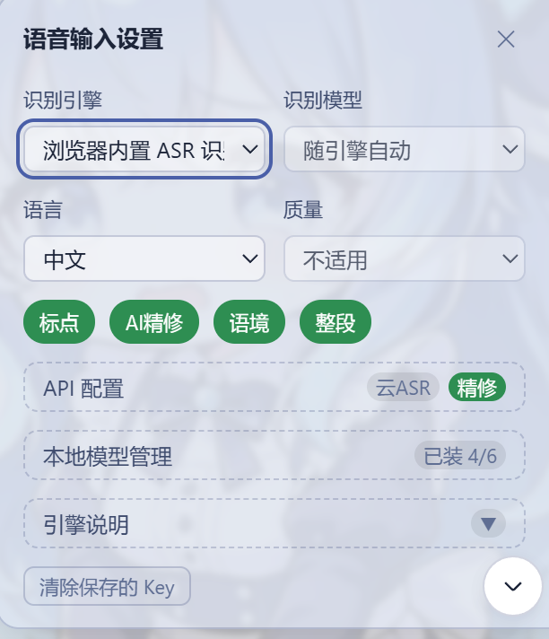
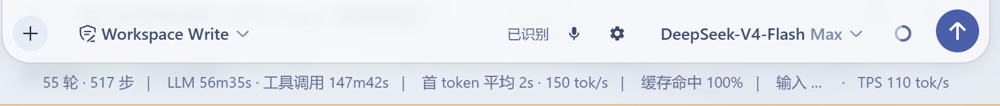

# DSH 语音输入插件

在 DSH 输入栏直接语音输入文字：实时听写与整段录音两种方式，识别引擎可选浏览器内置、本地 whisper、FunASR 或云服务，识别后可选 DeepSeek 精修。

[](LICENSE)
[](https://github.com/Rio-promax/dsh-voice-input/releases)

## 功能

- **实时听写**：边说边识别，停顿自动切句
- **整段模式**：录完再识别，适合长段口述
- **识别引擎**：浏览器内置 ASR / 本地 whisper / FunASR（中文）/ 云 ASR（OpenAI 兼容、豆包）
- **AI 精修**：DeepSeek 后台纠错（同音字、标点），可参考最近聊天语境
- **本地引擎离线可用**，无额外费用，模型按需下载

## 界面预览





## 安装

需要 DSH 与 Python 3.9+。

**Windows**：

```powershell
git clone https://github.com/Rio-promax/dsh-voice-input.git
cd dsh-voice-input
pwsh -File install.ps1
```

install.ps1 会完成：复制插件到 dsh profiles、注册组合、创建 .venv 并安装 Python 依赖（faster-whisper + FunASR-ONNX，无 torch）。国内网络可加 `-Mirror https://pypi.tuna.tsinghua.edu.cn/simple`。

**Linux / macOS**：见 `voice-input-plugin/DISTRIBUTION.md`（setup.sh + 手动部署）。

重启 dsh 后，输入栏右侧出现 🎤 与 ⚙ 按钮。

## 使用

- 点 🎤 开始录音，再点一次停止
- ⚙ 设置：引擎、模型、语言、标点、AI 精修、语境、整段
- 本地模型在「本地模型管理」中查看下载状态（绿点 = 已下载）并下载

## 环境要求

- **浏览器**：Chrome / Edge 可用浏览器内置 ASR；Firefox / Safari 自动走本地听写。录音需要 HTTPS 或 localhost
- **Python**：3.9+，安装脚本自动创建 .venv
- **硬件**：建议双核 CPU + ≥4GB 内存（本地模型常驻 1-1.6GB）；模型首次下载 0.1-3GB
- **网络**：首次安装需联网下载依赖与模型；国内默认镜像，海外用户下载慢时设置 `DSH_HF_ENDPOINT=https://huggingface.co`（whisper）或 `MODELSCOPE_ENDPOINT`（FunASR）
- **可选**：AI 精修需 DeepSeek API Key；云 ASR 需服务商 Key

## 常见问题

- **Firefox / Safari 能用浏览器内置 ASR 吗？** 不能，会自动走本地听写；建议直接选「本地FunASR」或「本地 base whisper」
- **本地模型内存占用大？** 1-1.6GB 属正常；切换引擎时旧模型自动释放
- **识别结果有重复字词？** 默认已做尾部静音裁剪；精修会合并重复字词与标点

## 许可

MIT。组件许可清单见 `voice-input-plugin/DISTRIBUTION.md`。
